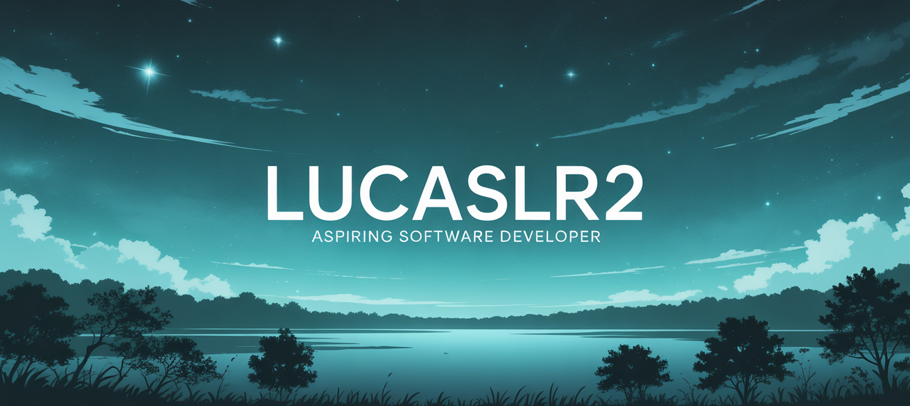

#  Hi, I'm Lucas!

<div align="center">
  
</div>

<div align="center">

---

🎓 **Currently finishing my bilingual high school, starting university next year**  

---

💻 **Passionate about software development, technology, and innovation**  

---

🌱 **Continuously learning and building projects to sharpen my skills**  

---

</div>

---

##  About Me

```javascript
const lucas = {
    location: "Uruguay",
    education: "Bilingual High School Student",
    nextStep: "University 2026",
    interests: ["Software Development", "Technology", "Innovation"],
    currentlyLearning: ["Advanced Programming", "Web Development", "Problem Solving"],
    funFact: "I love turning ideas into code! 💡➡️💻"
};
```

---

##  Tech Stack

<div align="center">

### Programming Languages


### Web Technologies  


### Tools & Others


</div>

---

##  GitHub Stats

<div align="center">
  
  
</div>

<div align="center">
  
</div>

---

##  Let's Connect!

<div align="center">
  
[](https://www.linkedin.com/in/lucas-larraura-8137462ba/)
[](mailto:llaarraura@gmail.com)
[](https://github.com/LucasLR2)

</div>

---

<div align="center">
  
###  

**"Passionate about learning, growing, and contributing value to every project."**


</div>

---

<div align="center">
  
</div>
