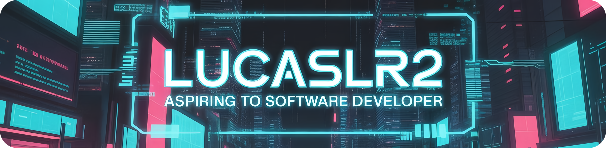

# 👋 Hi, I'm Lucas

🎓 Currently finishing my bilingual high school, starting university next year.  
💻 Passionate about software development, technology, and innovation.  
🌱 Continuously learning and building projects to sharpen my skills.  

---

## 📊 GitHub Stats
  

---

## 🌐 Connect with me
  
  

---

✨ _Passionate about learning, growing, and contributing value to every project._
